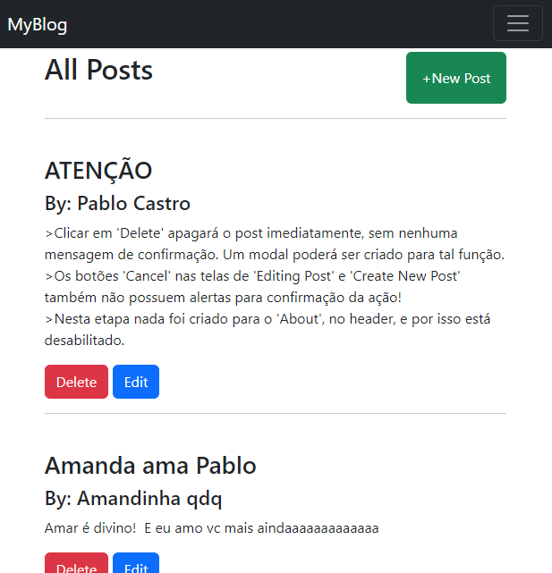

<h1 align="center"> MyBlog </h1>

    Este é um projeto básico de utilização do Flask e FlaskSQLAchemy para
    criação, exclusão e atualização de posts em um blog.

 

🚀 Tecnologias

Esse projeto foi desenvolvido com as seguintes tecnologias:

    Python:
        Flask
        Flask SQLAlchemy
    HTML e Bootstrap

 

💻 Projeto

 

Este foi um exercicio realizado para a aprendizado do Flask e Flask-SQLALchemy, como uma
forma de introdução ao mundo Backend.

Para iniciar a aplicação executar 'python app.py', via linha de comando. Isso iniciará o servidor local, então, acesse 'http://localhost:5000/'.

Você pode criar, editar e deletar posts.

 

 

📝 Licença

Esse projeto está sob a licença MIT.